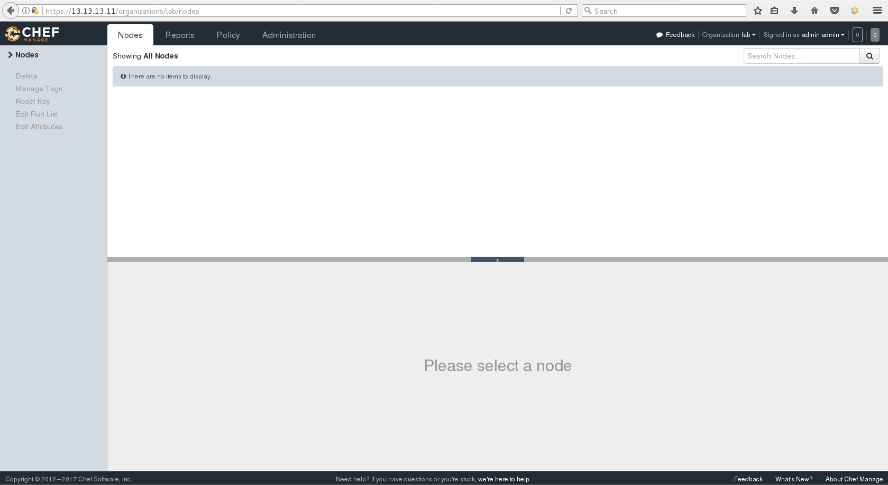
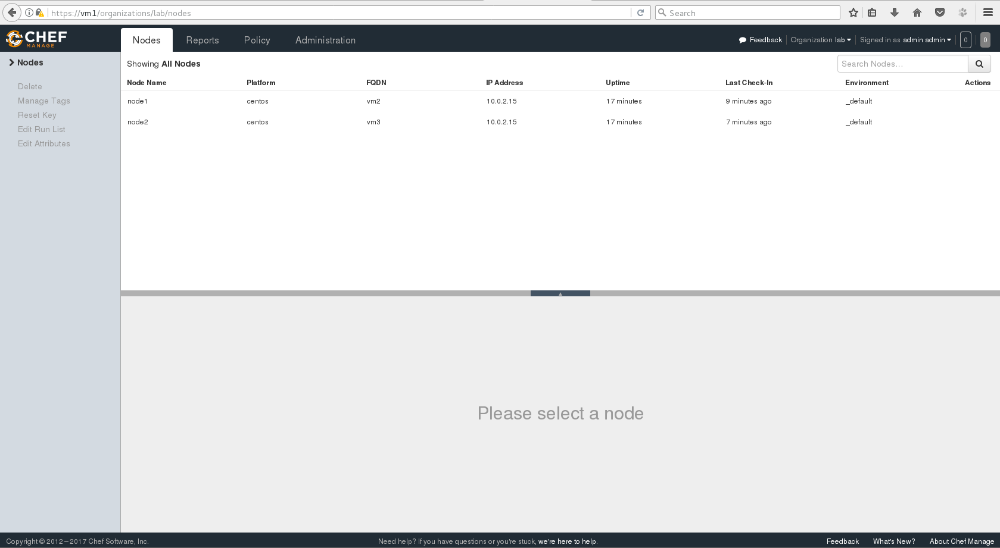
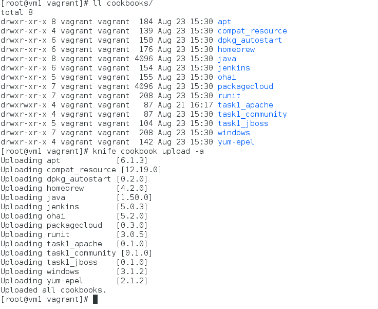
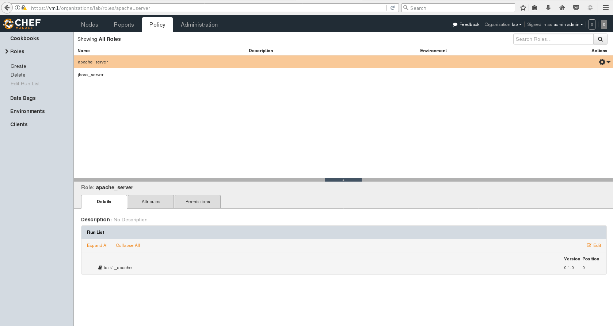
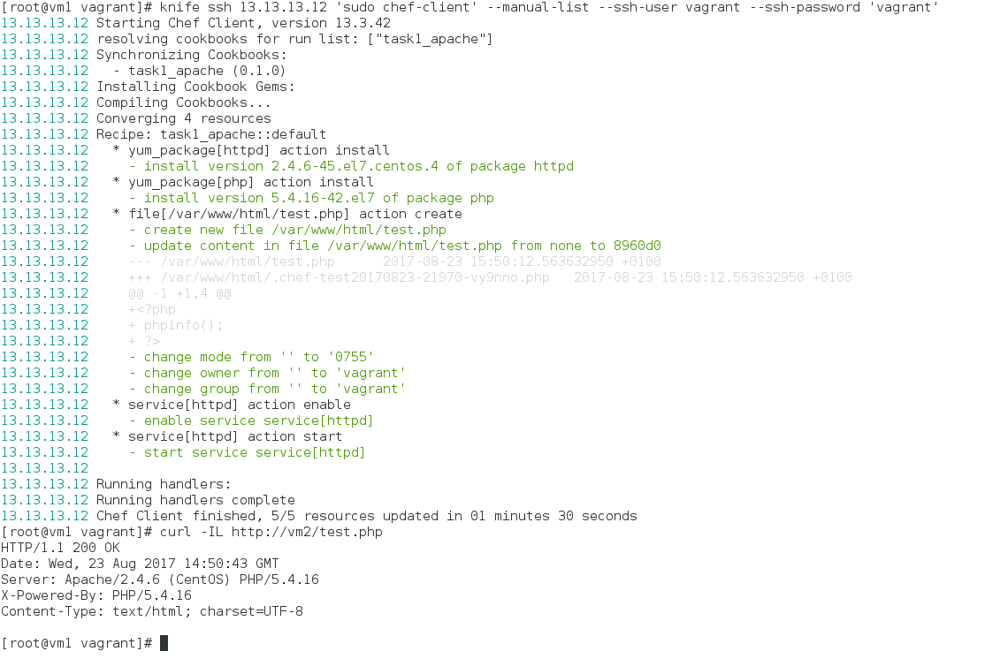

### Task3

*task3_database*

### First point was skipped. Vagrantfile pushed instead.

## 2. Install chef server on VM:

## 3. Configure Knife node list:

### knife.rb pushed.

## 4. Upload cookbooks:

## 5-8. Nodes bootstrapped, Roles created and attached to Nodes:

### Checkout: all works nominal:

